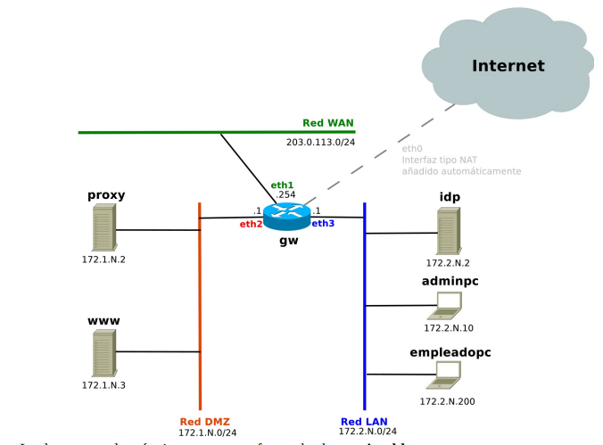
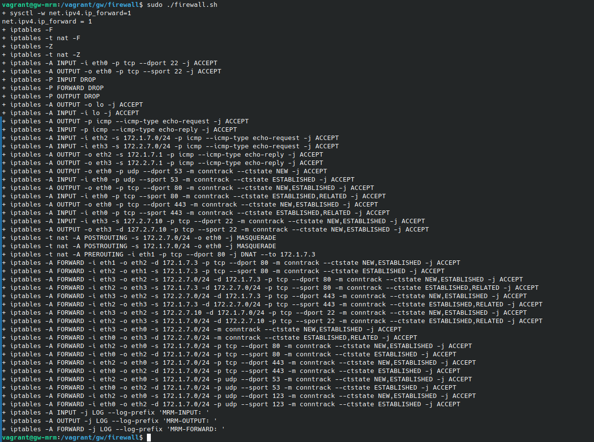
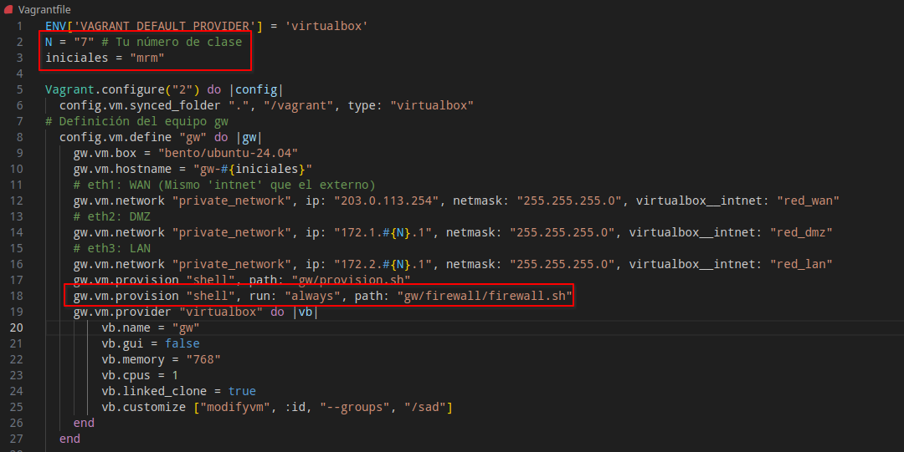

## Readme de la practica de SAD vagrant

## Red de la practica


## Firewall.sh 
```
set -x
```
## Activar IP forwarding
```
sysctl -w net.ipv4.ip_forward=1
```

### Limpiamos las reglas existentes
```
iptables -F
iptables -t nat -F
iptables -Z
iptables -t nat -Z
```
### ANTI-LOCK Rules: Permitir el acceso SSH desde la red local
```
iptables -A INPUT -i eth0 -p tcp --dport 22 -j ACCEPT
iptables -A OUTPUT -o eth0 -p tcp --sport 22 -j ACCEPT
```

### Politicas por defecto
```
iptables -P INPUT DROP
iptables -P FORWARD DROP
iptables -P OUTPUT DROP
```

## Reglas de proteccion local

### L1. Permitir trafico de loopback
```
iptables -A OUTPUT -o lo -j ACCEPT
iptables -A INPUT -i lo -j ACCEPT
```

### L2 Permitir ping a maquina externa e interna
```
iptables -A OUTPUT -p icmp --icmp-type echo-request -j ACCEPT
iptables -A INPUT -p icmp --icmp-type echo-reply -j ACCEPT
```

### L3 Permitir que me hagan desde LAN y DMZ
```
iptables -A INPUT -i eth2 -s 172.1.7.0/24 -p icmp --icmp-type echo-request -j ACCEPT
iptables -A INPUT -i eth3 -s 172.2.7.0/24 -p icmp --icmp-type echo-request -j ACCEPT
iptables -A OUTPUT -o eth2 -s 172.1.7.1 -p icmp --icmp-type echo-reply -j ACCEPT
iptables -A OUTPUT -o eth3 -s 172.2.7.1 -p icmp --icmp-type echo-reply -j ACCEPT
```

### L4 Permitir consultas DNS
```
iptables -A OUTPUT -o eth0 -p udp --dport 53 -m conntrack --ctstate NEW -j ACCEPT
iptables -A INPUT -i eth0 -p udp --sport 53 -m conntrack --ctstate ESTABLISHED -j ACCEPT
```

### L5 Permitir trafico HTTP/HTTPS saliente
```
iptables -A OUTPUT -o eth0 -p tcp --dport 80 -m conntrack --ctstate NEW,ESTABLISHED -j ACCEPT
iptables -A INPUT -i eth0 -p tcp --sport 80 -m conntrack --ctstate ESTABLISHED,RELATED -j ACCEPT
iptables -A OUTPUT -o eth0 -p tcp --dport 443 -m conntrack --ctstate NEW,ESTABLISHED -j ACCEPT
iptables -A INPUT -i eth0 -p tcp --sport 443 -m conntrack --ctstate ESTABLISHED,RELATED -j ACCEPT
```

### L6 Permitir trafico SSH solo desde adminpc
```
iptables -A INPUT -i eth3 -s 127.2.7.10 -p tcp --dport 22 -m conntrack --ctstate NEW,ESTABLISHED -j ACCEPT
iptables -A OUTPUT -o eth3 -d 127.2.7.10 -p tcp --sport 22 -m conntrack --ctstate NEW,ESTABLISHED -j ACCEPT
```


## Reglas de proteccion de red

### R1. Se debe hacer NAT del trafico saliente
```
iptables -t nat -A POSTROUTING -s 172.2.7.0/24 -o eth0 -j MASQUERADE
iptables -t nat -A POSTROUTING -s 172.1.7.0/24 -o eth0 -j MASQUERADE
```

### R2. Permitir acceso desde la WAN a WWW a traves del 80 haciendo part forwarding
```
iptables -t nat -A PREROUTING -i eth1 -p tcp --dport 80 -j DNAT --to 172.1.7.3 
iptables -A FORWARD -i eth1 -o eth2 -d 172.1.7.3 -p tcp --dport 80 -m conntrack --ctstate NEW,ESTABLISHED -j ACCEPT 
iptables -A FORWARD -i eth2 -o eth1 -s 172.1.7.3 -p tcp --sport 80 -m conntrack --ctstate ESTABLISHED -j ACCEPT
```

### R3.a Usuarios de la LAN pueden acceder a 80 y 443 de www
```
iptables -A FORWARD -i eth3 -o eth2 -s 172.2.7.0/24 -d 172.1.7.3 -p tcp --dport 80 -m conntrack --ctstate NEW,ESTABLISHED -j ACCEPT
iptables -A FORWARD -i eth2 -o eth3 -s 172.1.7.3 -d 172.2.7.0/24 -p tcp --sport 80 -m conntrack --ctstate ESTABLISHED,RELATED -j ACCEPT
iptables -A FORWARD -i eth3 -o eth2 -s 172.2.7.0/24 -d 172.1.7.3 -p tcp --dport 443 -m conntrack --ctstate NEW,ESTABLISHED -j ACCEPT
iptables -A FORWARD -i eth2 -o eth3 -s 172.1.7.3 -d 172.2.7.0/24 -p tcp --sport 443 -m conntrack --ctstate ESTABLISHED,RELATED -j ACCEPT
```

### R3.b Adminpc puede acceder por ssh a todo en la DMZ
```
iptables -A FORWARD -i eth3 -o eth2 -s 172.2.7.10 -d 172.1.7.0/24 -p tcp --dport 22 -m conntrack --ctstate NEW,ESTABLISHED -j ACCEPT
iptables -A FORWARD -i eth2 -o eth3 -s 172.1.7.0/24 -d 172.2.7.10 -p tcp --sport 22 -m conntrack --ctstate ESTABLISHED,RELATED -j ACCEPT
```

### R4. Permitir salir trafico de la LAN
```
iptables -A FORWARD -i eth3 -o eth0 -s 172.2.7.0/24 -m conntrack --ctstate NEW,ESTABLISHED -j ACCEPT
iptables -A FORWARD -i eth0 -o eth3 -d 172.2.7.0/24 -m conntrack --ctstate ESTABLISHED,RELATED -j ACCEPT
```

### R5. Permitir salir trafico de la DMZ (solo http/https/dns/ntp)
```
iptables -A FORWARD -i eth2 -o eth0 -s 172.1.7.0/24 -p tcp --dport 80 -m conntrack --ctstate NEW,ESTABLISHED -j ACCEPT 
iptables -A FORWARD -i eth0 -o eth2 -d 172.1.7.0/24 -p tcp --sport 80 -m conntrack --ctstate ESTABLISHED -j ACCEPT 

iptables -A FORWARD -i eth2 -o eth0 -s 172.1.7.0/24 -p tcp --dport 443 -m conntrack --ctstate NEW,ESTABLISHED -j ACCEPT 
iptables -A FORWARD -i eth0 -o eth2 -d 172.1.7.0/24 -p tcp --sport 443 -m conntrack --ctstate ESTABLISHED -j ACCEPT 

iptables -A FORWARD -i eth2 -o eth0 -s 172.1.7.0/24 -p udp --dport 53 -m conntrack --ctstate NEW,ESTABLISHED -j ACCEPT 
iptables -A FORWARD -i eth0 -o eth2 -d 172.1.7.0/24 -p udp --sport 53 -m conntrack --ctstate ESTABLISHED -j ACCEPT 

iptables -A FORWARD -i eth2 -o eth0 -s 172.1.7.0/24 -p udp --dport 123 -m conntrack --ctstate NEW,ESTABLISHED -j ACCEPT 
iptables -A FORWARD -i eth0 -o eth2 -d 172.1.7.0/24 -p udp --sport 123 -m conntrack --ctstate ESTABLISHED -j ACCEPT
```
### Logs para depurar
```
iptables -A INPUT -j LOG --log-prefix "MRM-INPUT: "
iptables -A OUTPUT -j LOG --log-prefix "MRM-OUTPUT: "
iptables -A FORWARD -j LOG --log-prefix "MRM-FORWARD: "
```

## Ejecucion del script:


## Cambios en el archivo vagrant files
Cambiamos el numero de clase y las iniciales y añadimos una linea de codigo para que el firewall se ejecute al iniciar la maquina gw
k

